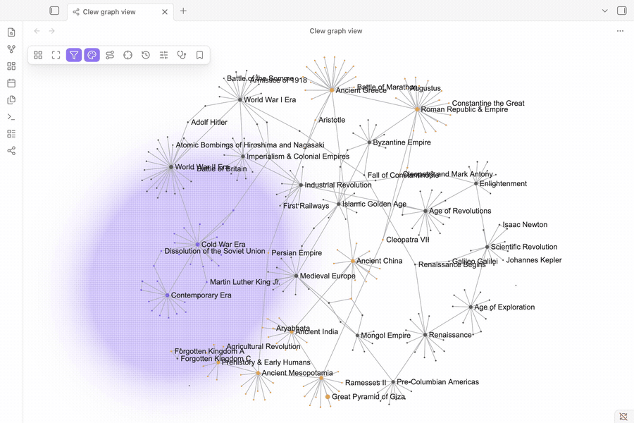

# Clew

[](https://github.com/christian-luger-at/obsidian-clew/releases)
[](https://obsidian.md)
[](LICENSE)
[](https://github.com/christian-luger-at/obsidian-clew/actions/workflows/lint.yml)
[](https://github.com/christian-luger-at/obsidian-clew/actions/workflows/coverage.yml)
[](../../issues)



**Clew shows your whole Obsidian vault as one interactive graph** - open it, and every note is a node, every link an edge. Zoom around, filter down to what matters, color and size notes by whatever makes sense to you, and click straight through to any note.

A plugin for [Obsidian](https://obsidian.md). Full documentation (with more screenshots) lives at **[the Clew guide](https://christian-luger-at.github.io/obsidian-clew/)**.

## Why use it

Obsidian's built-in graph shows everything at once, but it's a single fixed view: one color scheme, one layout, no way to narrow it down to just the notes you care about right now. Clew is a second, purpose-built graph view layered on top of your vault, and it can tell you things the built-in one can't:

- **Which notes are hubs.** Notes with more links render larger by default, and a link-count filter lets you isolate them directly - the notes the rest of your vault actually depends on.
- **Which notes are orphaned or isolated.** With no links in or out, they drift to the outskirts under the default Force layout on their own - an easy way to spot notes worth linking up or archiving.
- **Which topic areas have gone stale.** The "cluster freshness" criterion detects communities of linked notes, then compares how recently each one was edited relative to the others - so an old project's whole neighborhood can get its own color without you defining what "old" means note by note.
- **How everything relates to one specific note.** The Radial layout rings out every other note by hop distance from a note you pick.

Nothing here edits your notes - filters, groups, and appearance settings are Clew's own saved state, completely separate from your note content.

## Getting started

1. Install the plugin (see below) and enable it.
2. Click the **Clew** icon in the left ribbon, or run **"Open graph view"** from the command palette (`Ctrl/Cmd+P`).
3. That's it - the graph builds itself from your vault, no configuration needed. Everything below is optional tuning.

## What you can do

- **See your whole vault as a graph.** Every note and link, laid out automatically - no setup, no manual arrangement.
- **Choose a layout that fits what you're looking at.** Force-directed (the default - related notes cluster together), Hierarchical (top-down, for vaults with a real outline structure), Radial (rings out from one note by link distance), or Circular (every note evenly spaced, good for spotting recurring patterns). The layout picker explains what each one is for.
- **Filter down to what matters.** Build named, reusable filters from tags, properties, folder, filename, text, link count, edit recency, or how active/stale a note's neighborhood is - and invert any of them ("in this folder" ↔ "not in this folder") with one click. Combine several filters with either/or logic.
- **Color and size notes by your own rules.** Same criteria as filtering, applied as named, colored groups instead - so "everything tagged #project" or "notes I haven't touched in 30 days" gets its own color and size at a glance, with a legend explaining what's on screen.
- **Tune the look live.** Node/edge size, color, physics, and label density are all adjustable while watching the graph react.
- **Interact directly with the graph.** Click a node to open that note, hover one to highlight its connections, drag a note to pin it exactly where you want it.

> **Not switched on yet:** finding the shortest, hub-avoiding path between any two notes, and exporting that path to a Canvas file. The groundwork already exists in the codebase, but the feature is disabled pending further testing.

## Installing the plugin

### From the Community Plugins browser

1. Open **Settings → Community plugins → Browse** in Obsidian.
2. Search for **Clew** and click **Install**, then **Enable**.

### Manual installation

1. Download `main.js`, `styles.css`, and `manifest.json` from the [latest release](../../releases).
2. Copy them into `<YourVault>/.obsidian/plugins/clew/`.
3. Reload Obsidian and enable **Clew** under **Settings → Community plugins**.

## Compatibility

- Requires Obsidian **1.12.0** or later.
- Works on desktop. Mobile is declared supported (`isDesktopOnly: false`) but hasn't been verified on a tablet yet - see [DEVELOPMENT.md](DEVELOPMENT.md).

## Support

Found a bug or have a feature request? Please [open an issue](../../issues).

If Clew helps you, a ⭐ on the repo makes it easier for others to discover - thank you!

## Contributing

Contributions are welcome. See [CONTRIBUTING.md](CONTRIBUTING.md) for how to report issues, set up the project, and open a pull request, and [DEVELOPMENT.md](DEVELOPMENT.md) for the local dev workflow and the release process.

Quick start:

```bash
nvm use        # activate the Node version from .nvmrc
npm install    # install dependencies
npm run dev    # compile src/main.ts to main.js in watch mode
npm run build  # type-check and produce a production build
npm run lint   # ESLint, incl. the Obsidian-specific ruleset
```

## API documentation

See https://docs.obsidian.md

## License

Clew is licensed under [MIT](LICENSE).
